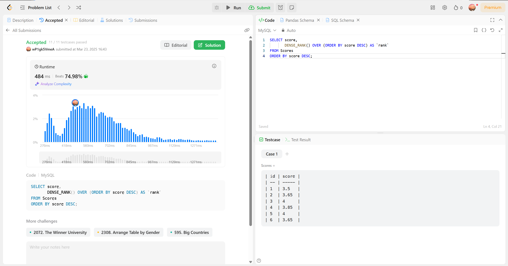
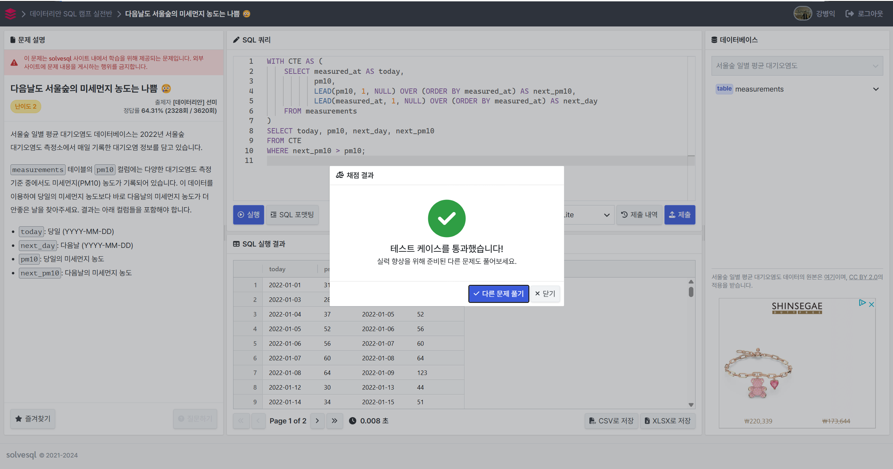
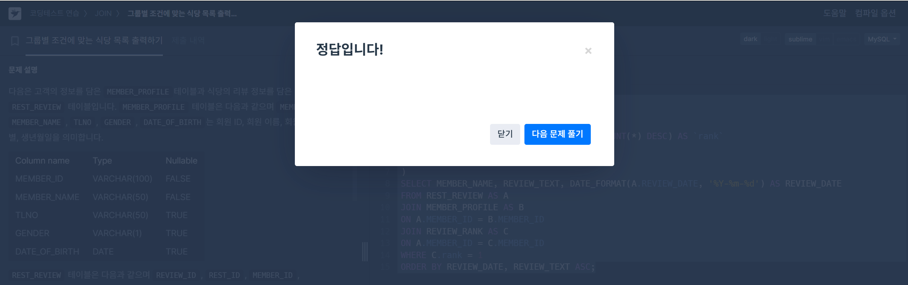

# 1주차

>## 📖 윈도우 함수 학습

📖 **공식 문서 참고**: 🔗 [MySQL 공식 문서 - 서브쿼리](https://dev.mysql.com/doc/refman/8.0/en/window-functions.html)

### 14.20 Window Functions

- 정의
윈도우 함수(Window Function)란, SQL에서 결과 집합의 행들을 그룹이 아닌 "행 단위로 계산"하면서도 다른 행의 값을 참조할 수 있게 해주는 함수입니다. <br>
일반적인 GROUP BY 집계 함수와 달리, 윈도우 함수는 각 쿼리 행에 대한 결과를 생성한다.<br>
**'행은 그대로 두고' 집계, 순위, 누적합 등을 계산할 때 쓰는 SQL 함수** 

- 형식
```sql
SELECT 컬럼명, 
       윈도우_함수() OVER (PARTITION BY 컬럼명 ORDER BY 컬럼명) AS 별칭
FROM 테이블명;
```

### 14.20.1 Window Function Descriptions
| 이름           | 역할                                                      |
|----------------|-------------------------------------------------------------------------|
| CUME_DIST()    | `누적 분포` 값                                                             |
| FIRST_VALUE()  | 윈도우 프레임 내 `첫 번째 행`의 값                                         |
| LAST_VALUE()   | 윈도우 프레임 내 `마지막 행`의 값                                          |
| LAG()          | 그룹 내 현재 행보다 `이전 행`의 값                                         |
| LEAD()         | 그룹 내 현재 행보다 `다음 행`의 값                                         |
| NTH_VALUE()    | 윈도우 프레임 내 `N번째 행`의 값                                           |
| NTILE()        | 그룹 내 현재 행이 속한 `버킷(동등하게 나눈 구간)  번호`                    |
| PERCENT_RANK() | 그룹 내 현재 행의 `백분위` 값                                      |
| RANK()         | 그룹 내 현재 행의 순위 (동점 처리 후 순위 건너뜀, 공동 순위 X)             |
| ROW_NUMBER()   | 그룹 내 현재 행의 고유 번호 (1부터 시작, 공동 순위 O)        |
| DENSE_RANK()   | 그룹 내 현재 행의 순위 (중간 순위 건너뛰지 않음, 공동 순위 O)    |

>#### LAG() 함수와 LEAD() 함수
LAG() 함수와 LEAD() 함수는 종종 행 간의 차이를 계산하는 데 사용
```sql
LAG(expr [, N[, default]]) [null_treatment] over_clause
LEAD(expr [, N[, default]]) [null_treatment] over_clause
```
- N: 이동할 행 수: 기본값 1 (생략 가능)
- default: 이전 행이 없을 때 반환할 값 (생략 가능)
>#### 순위 함수
| 함수명         | 동일한 값이 있을 때 | 순위 건너뛰기 여부 | 유일한 순위 보장 |
|--------------|-----------------|----------------|--------------|
| `ROW_NUMBER()`  | 동일한 값이어도 각 행에 다른 번호 부여 | O (고유한 값으로 부여됨) | O |
| `RANK()`       | 동일한 값이면 같은 순위 부여 | O (다음 순위 건너뜀, 예: 1, 1, 3) | X |
| `DENSE_RANK()` | 동일한 값이면 같은 순위 부여 | X (연속된 순위 유지, 예: 1, 1, 2) | X |

🔥 **차이점 요약**
- `ROW_NUMBER()`: 동일한 값이라도 **순차적으로 고유한 번호를 부여**함.
- `RANK()`: 동일한 값이면 같은 순위이지만 **다음 순위는 건너뜀**.
- `DENSE_RANK()`: 동일한 값이면 같은 순위이지만 **순위가 연속됨**.

>#### NTH_VALUE() 함수
```sql
NTH_VALUE(컬럼명, N) OVER (PARTITION BY 컬럼명 ORDER BY 컬럼명 ROWS BETWEEN ...)
```
- N: 가져오고 싶은 행 번호 (1부터 시작)
- ROWS BETWEEN 옵션을 잘 써야 정확하게 원하는 값을 가져옴
- 주의: 윈도우 프레임 범위가 중요해서 기본값으론 현재 행부터 끝까지 보는 경우가 많음
>#### NTILE() 함수
```sql
NTILE(N) OVER (PARTITION BY 컬럼명 ORDER BY 컬럼명)
```
- N: 나눌 버킷 개수
- 행의 수를 N으로 나누고, 순서대로 그룹 번호(1~N)를 부여함

### 14.20.2 Window Function Concepts and Syntax
>#### OVER 절의 기본 구조 
1. OVER (window_spec)
- 직접 윈도우를 정의하는 방식
- PARTITION BY, ORDER BY, ROWS BETWEEN 등을 넣어 계산 범위를 직접 지정
```sql
SELECT employee_id, salary,
       RANK() OVER (PARTITION BY department_id ORDER BY salary DESC) AS rank_in_dept
FROM employees;
```
2. OVER window_name 
- 미리 정의해 둔 윈도우 이름을 불러오는 방식
- WINDOW window_name AS (window_spec) 구문으로 먼저 정의해 놓고, 나중에 반복해서 호출할 때 사용
```sql
SELECT employee_id, salary,
       RANK() OVER dept_window AS rank_in_dept, # 1번 사용
       SUM(salary) OVER dept_window AS total_salary_in_dept # 2번 사용
FROM employees
WINDOW dept_window AS (PARTITION BY department_id ORDER BY salary DESC); # dept_window라는 윈도우 생성
```

* OVER 안에 들어갈 수 있는 주요 조건들

| 조건명       |설명                 |
|----------------|-------------------------------|
|PARTITION BY    | 그룹을 나눠서 그룹별로 계산                |
| ORDER BY | 윈도우 내에서 계산 순서를 정하기. 순위 함수에서 필수적입니다|
| ROWS / RANGE   | 윈도우 프레임(계산 범위)을 직접 지정 ROWS BETWEEN ... AND ... 같은 형태로 사용합니다. (범위 조절)     |
| window_name        | WINDOW 절에서 미리 정의한 이름을 호출해 사용합니다.     |

### 14.20.4 Named Windows
> #### 기본 구조
```sql
WINDOW window_name AS (window_spec) 
    [, window_name AS (window_spec)] ... -- # window_spec: [window_name] [partition_clause] [order_clause] [frame_clause]
```
>#### 주의할 점
- 아래와 같이 사이클(반복)이 나타나면 오류
```sql
WINDOW w1 AS (w2), w2 AS (w3), w3 AS (w1)
```

### Aggregate Function + OVER()
- 집계 함수 + OVER()를 쓰면 원본 행은 그대로 두고, 그룹/정렬/범위까지 자유롭게 분석하는 강력한 분석용 함수로 확장된다. 
>#### 기본 구조
```sql
SELECT column1,
       SUM(column2) OVER (PARTITION BY column1 ORDER BY column3) AS running_total --OVER() 안의 조건으로 집계 범위와 방식을 제어
FROM table_name;
```
> #### 예시
1. 전체 누적합 계산
```sql
-- 전체 직원의 salary 합을 모든 행에 출력
SELECT employee_id, salary,
       SUM(salary) OVER () AS total_salary
FROM employees;
```
2. 부서별 누적합 계산
```sql
-- 부서별로 hire_date 순서대로 salary 누적합 계산
SELECT department_id, employee_id, salary,
       SUM(salary) OVER (PARTITION BY department_id ORDER BY hire_date) AS running_total
FROM employees;
```
3. 최근 3명 기준 이동 평균
```sql
-- 입사일 순으로 최근 3명(현재 + 2명 전)의 평균 급여 계산
SELECT employee_id, salary,
       AVG(salary) OVER (ORDER BY hire_date ROWS BETWEEN 2 PRECEDING AND CURRENT ROW) AS moving_avg
FROM employees;
```

>## 🔎 문제 풀이

### 🔗 [LeetCode - Rank Scores](https://leetcode.com/problems/rank-scores/description/) `DENSE_RANK()`
```sql
SELECT score,
       DENSE_RANK() OVER (ORDER BY score DESC) AS `rank`
FROM Scores
ORDER BY score DESC;
```

- rank 자체가 윈도우 함수 이름이기 때문에 혼란 발생 가능 → 'rank' 사용

### 🔗 [Solvesql - 다음날도 서울숲의 미세먼지 농도는 나쁨 😢](https://solvesql.com/problems/bad-finedust-measure/) `LEAD()`
```sql
WITH CTE AS (
    SELECT measured_at AS today,
           pm10,
           LEAD(pm10, 1, NULL) OVER (ORDER BY measured_at) AS next_pm10,
           LEAD(measured_at, 1, NULL) OVER (ORDER BY measured_at) AS next_day
    FROM measurements
)
SELECT today, pm10, next_day, next_pm10
FROM CTE
WHERE next_pm10 > pm10;
```

### 🔗 [programmers - 그룹별 조건에 맞는 식당 목록 출력하기](https://school.programmers.co.kr/learn/courses/30/lessons/131124) (도전!!)
```sql
WITH REVIEW_RANK AS (
    SELECT MEMBER_ID, 
           COUNT(*) AS review_cnt,
           DENSE_RANK() OVER (ORDER BY COUNT(*) DESC) AS `rank`
    FROM REST_REVIEW
    GROUP BY MEMBER_ID
)
SELECT MEMBER_NAME, REVIEW_TEXT, DATE_FORMAT(A.REVIEW_DATE, '%Y-%m-%d') AS REVIEW_DATE
FROM REST_REVIEW AS A
JOIN MEMBER_PROFILE AS B
ON A.MEMBER_ID = B.MEMBER_ID
JOIN REVIEW_RANK AS C
ON A.MEMBER_ID = C.MEMBER_ID
WHERE C.rank = 1
ORDER BY REVIEW_DATE, REVIEW_TEXT ASC;
```

