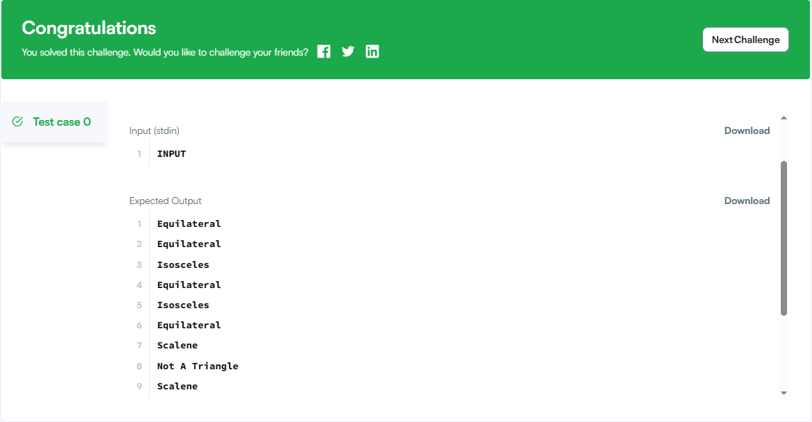
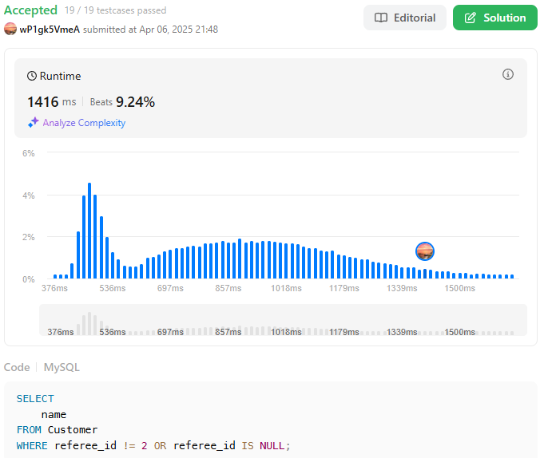

# 3주차

## 📖 CASE문 & 비교, 논리 연산자 활용

### 14.5 Flow Control Functions
📖 **공식 문서 참고**:

- 🔗 [MySQL 공식 문서 - 흐름제어함수](https://dev.mysql.com/doc/refman/8.4/en/flow-control-functions.html)

#### 종류
|이름|설명|
|---|---|
|CASE|다중 조건 연산자|
|IF()|if/else 구조 연산자|
|IFNULL(expr1, expr2)|expr1이 NULL이면 expr2를 반환하고, 아니면 expr1을 반환|
|NULLIF(expr1, expr2)|expr1과 expr2가 같으면 NULL을 반환하고, 다르면 expr1을 반환|

#### CASE
1. 각각 value를 `직접 비교`하여 비교결과가 처음으로 참이 될 때 result 반환
```sql
CASE value 
    WHEN compare_value THEN result 
    [WHEN compare_value THEN result ...] 
    [ELSE result] 
END
```
2. `조건을 지정`한 뒤 조건을 만족하는(참인) result 반환
```sql
CASE 
    WHEN condition THEN result 
    [WHEN condition THEN result ...] 
    [ELSE result]  
END
```

* NOTE
1. WHEN과 ELSE 조건에 해당하는 것이 없으면 기본으로 NULL을 반환함
2. 저장 프로시저나 함수에서 CASE 문(statement) 을 쓸 때
    - ELSE NULL을 넣으면 안 되고
    - END가 아닌 END CASE로 끝내야 한다

* CASE 표현식의 반환 타입
    - 조건절 결과값들의 공통 타입으로 결정
    
    1. 숫자형이면: double → decimal → 정수 순으로 우선순위 적용.
    2. 문자형이면: 가장 긴 길이 기준의 VARCHAR.
    3. 날짜/시간형이면: 동일 타입이면 그대로, 혼합이면 DATETIME.
    4. BIT, YEAR, JSON, GEOMETRY 등은 각각의 규칙을 따르고,
    5. BLOB이 하나라도 포함되면 결과는 BLOB, 그 외 혼합은 VARCHAR로 처리
#### IF
```sql
IF(expr1,expr2,expr3)
```
- expr1이 참이면 expr2를 반환, 거짓이면 expr3을 반환

* IF() 함수는 NULL이 하나만 있을 경우, NULL이 아닌 쪽의 타입을 따른다.
    1. 하나라도 문자열이면 → 문자열
    2. 둘 다 문자열이면 → 둘 중 하나라도 대소문자 구분 시, 결과도 구분
    3. 하나라도 실수면 → 실수
    4. 둘 다 정수면 → 정수
#### IFNULL
```sql
IFNULL(expr1,expr2)
```
- expr1이 NULL이면 expr2를 반환하고, 아니면 expr1을 반환
- NULL 값을 다른 값으로 대체하고 싶을 때 사용
#### NULLIF
```sql
IF(expr1,expr2,expr3)
```
- expr1과 expr2가 같으면 NULL을 반환하고, 다르면 expr1을 반환
- 두 값이 같을 경우 특정 계산을 막거나 회피할 때 사용 (예: 0으로 나누기 방지 등).
### 14.4.2 Comparison Functions and Operators
- 🔗 [MySQL 공식 문서 - 비교, 논리연산자](https://dev.mysql.com/doc/refman/8.4/en/comparison-operators.html)

####  1. 기본 비교 연산자

| 연산자       | 의미           |
|--------------|----------------|
| `=`          | 같음           |
| `<>`, `!=`   | 같지 않음      |
| `<`, `<=`    | 작음 / 작거나 같음 |
| `>`, `>=`    | 큼 / 크거나 같음  |
| `<=>`        | NULL-safe 비교 (둘 다 NULL이면 1 반환) |

---

#### 2. 범위 및 집합 비교

| 연산자 / 함수            | 설명                                  |
|--------------------------|---------------------------------------|
| `BETWEEN a AND b`        | a 이상 b 이하인지 확인               |
| `NOT BETWEEN a AND b`    | 위의 반대                            |
| `IN (v1, v2, ...)`       | 값이 목록에 포함되는지 확인         |
| `NOT IN (v1, v2, ...)`   | 목록에 포함되지 않는지 확인         |

> ⚠ 문자열/숫자 혼합 시 타입 변환 주의

---

#### 3. NULL 관련 비교

| 연산자 / 함수                 | 설명                                   |
|------------------------------|----------------------------------------|
| `IS NULL`                    | 값이 NULL인지 확인                     |
| `IS NOT NULL`                | 값이 NULL이 아닌지 확인               |
| `ISNULL(expr)`               | expr이 NULL이면 1, 아니면 0 반환       |
| `COALESCE(v1, v2, ...)`      | NULL이 아닌 첫 번째 값 반환           |

---

#### 4. 존재 여부 확인

| 함수                          | 설명                                   |
|-------------------------------|----------------------------------------|
| `EXISTS (SELECT ...)`         | 서브쿼리 결과가 존재하는지 확인 (1 반환) |
| `NOT EXISTS (SELECT ...)`     | 서브쿼리 결과가 없으면 1 반환           |

---

#### 5. 최댓값/최솟값 비교

| 함수                           | 설명                                    |
|--------------------------------|-----------------------------------------|
| `GREATEST(v1, v2, ...)`        | 가장 큰 값 반환                         |
| `LEAST(v1, v2, ...)`           | 가장 작은 값 반환                       |
| `INTERVAL(N, N1, N2, ...)`     | N이 어디 구간에 속하는지 인덱스 반환    |

---

#### 6. 문자열 비교

| 함수                 | 설명                                                     |
|----------------------|----------------------------------------------------------|
| `STRCMP(s1, s2)`     | 문자열 비교 (0: 같음, -1: s1 < s2, 1: s1 > s2)           |
| `LIKE`, `NOT LIKE`   | 패턴 매칭 (`_`, `%` 사용)                                 |

> 🔸 문자열 비교는 기본적으로 **대소문자 구분 없음**, 문자셋은 `utf8mb4` 사용

---

#### 7. 논리 비교

| 연산자 / 함수               | 설명                                     |
|-----------------------------|------------------------------------------|
| `IS TRUE`, `IS FALSE`       | 참 / 거짓인지 비교                       |
| `IS UNKNOWN`                | 불확실한 상태(NULL 등)인지 확인         |
| `IS NOT TRUE`, 등           | 반대 조건 확인                          |


## 📝 **문제 풀이**:

#### 🔗 [HackerRank - 삼각형 종류 분류하기](https://www.hackerrank.com/challenges/what-type-of-triangle/problem) `CASE문`
```sql
SELECT 
    CASE
        WHEN A + B <= C OR A + C <= B OR B + C <= A THEN 'Not A Triangle'
        -- 삼각형인지 아닌지 먼저 확인해야 나머지 조건이 의미 있음
        WHEN A = B AND B = C THEN 'Equilateral'
        WHEN A = B OR B = C OR A = C THEN 'Isosceles'
        ELSE 'Scalene'
    END AS triangle_type
FROM TRIANGLES;
```

#### 🔗 [LeetCode - find-customer-referee](https://leetcode.com/problems/find-customer-referee/description/) `IS NULL`
```sql
SELECT
    name
FROM Customer
WHERE referee_id != 2 OR referee_id IS NULL;
```
